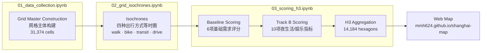
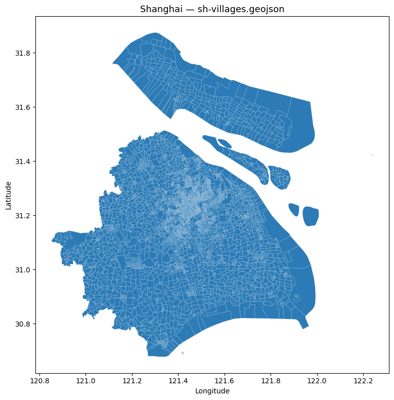
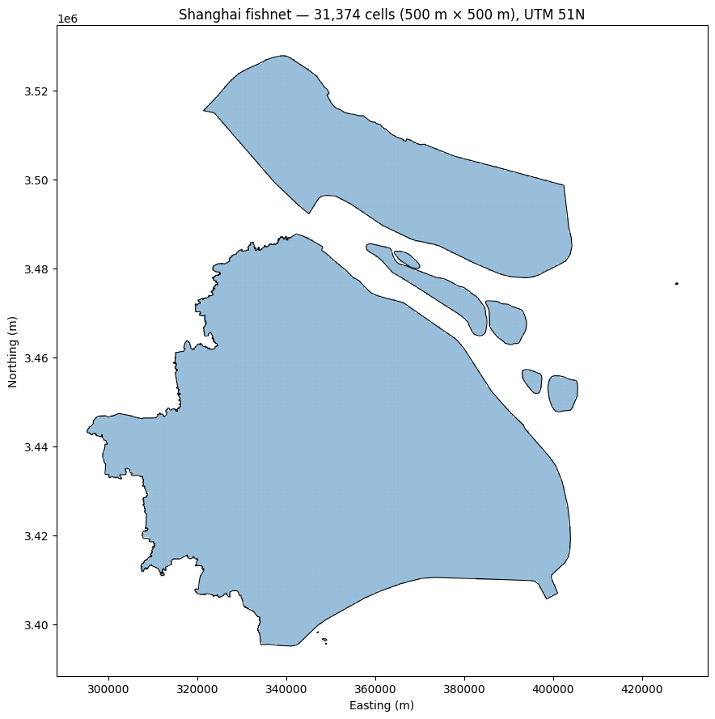
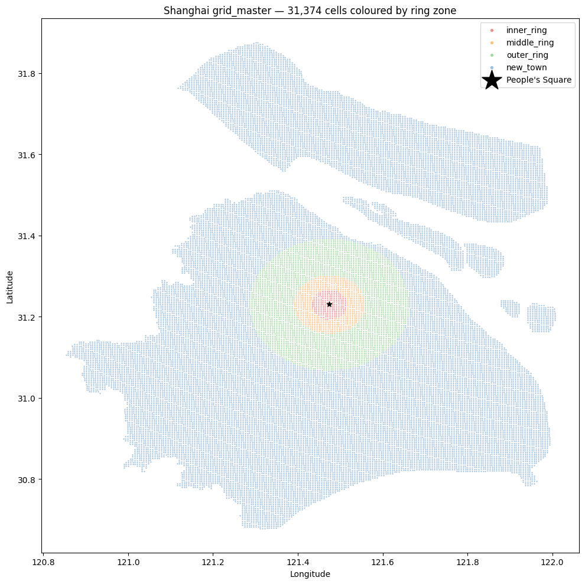
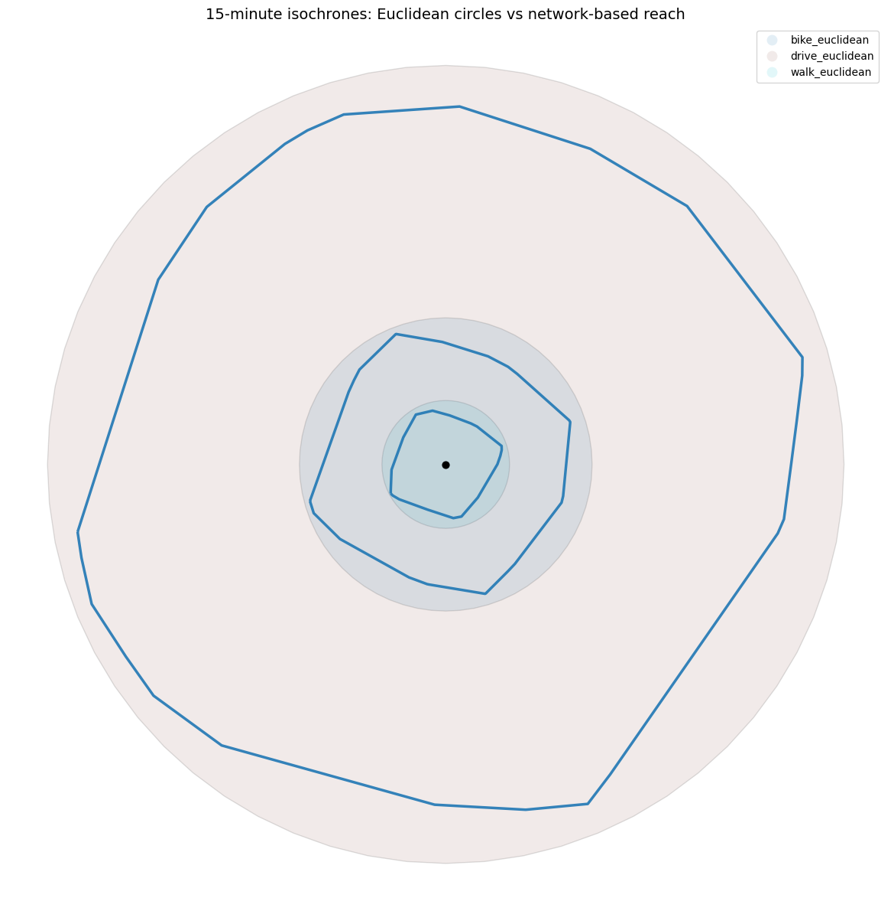
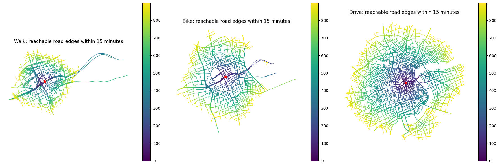
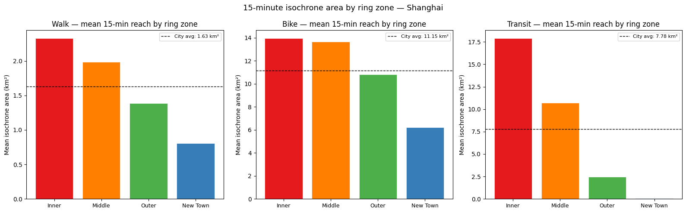
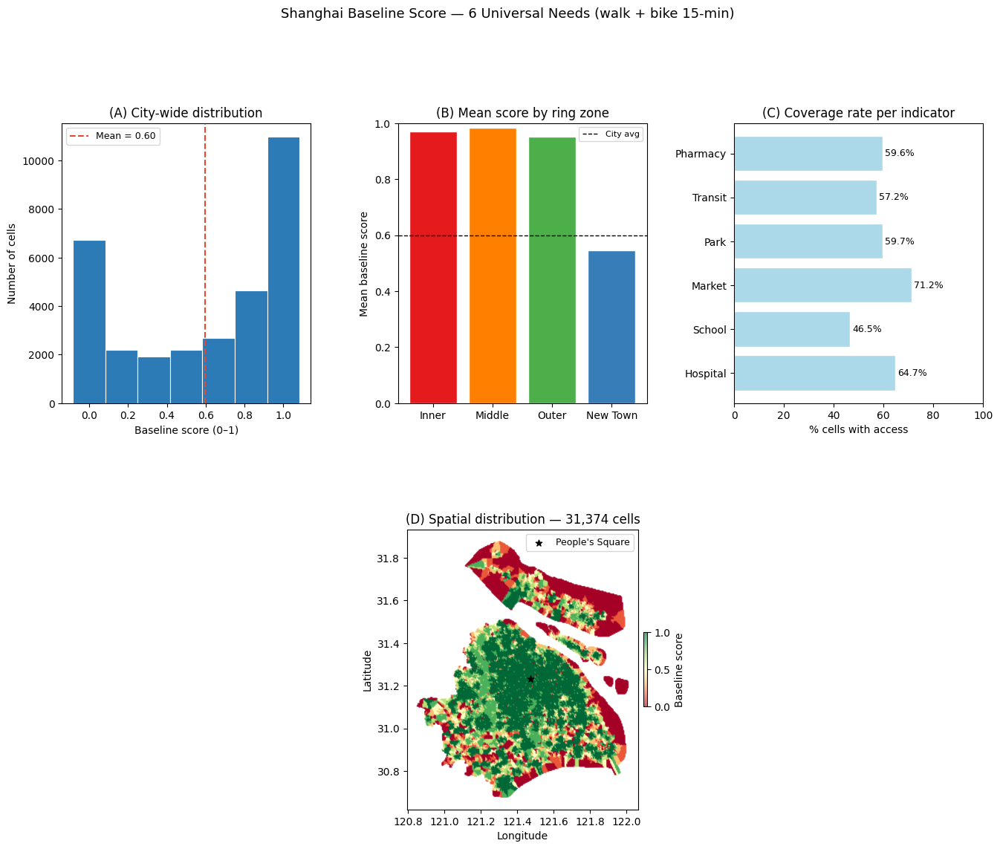
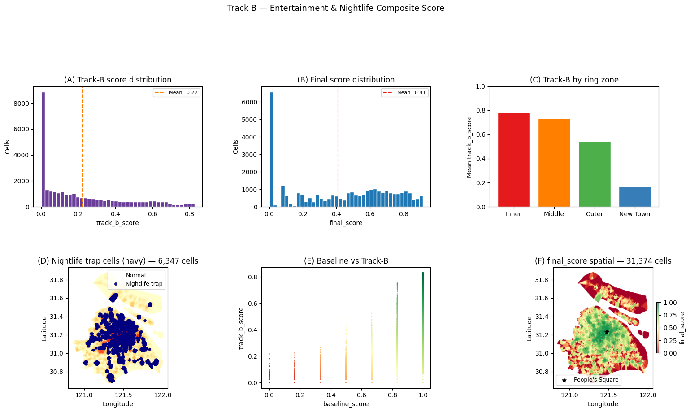

# Beyond the Inner Ring: Is Shanghai's Nightlife Truly Walkable?
### Mapping Entertainment Access and the Late-Night Transit Gap across Shanghai's 500 m Grid

# 不止内环：上海的夜生活真的「步行可达」吗？
### 绘制全上海娱乐可达性与深夜交通缺口地图

*15-Minute Shanghai — Track B: Entertainment & Nightlife / 「15分钟上海」项目 · Track B 娱乐与夜生活赛道*

**Author / 作者:** Mei Minghao · SHU Urban Data Analysis / 上海大学 城市数据分析
**Status / 状态:** Project completed — June 1, 2026 / 项目已于2026年6月1日完成
**Scope / 范围:** All of Shanghai Municipality, 500 m grid resolution, 31,374 cells → 14,184 H3 hexagons

> *Note: the project's working title (and the brief) used an approximate figure of "~25,000 grid cells." The final clipped grid came out to 31,374 — see Section 01 for why.*
> *说明：项目最初的工作标题及brief中使用的是"约25,000个网格"的估算值。最终裁剪后的网格实际为31,374个——具体原因见第01节。*

**Live demo / 在线演示:** [上海15分钟夜生活可达性地图](https://mmh624.github.io/shanghai-map/shanghai_nightlife_bmap.html)
**Source code (web app) / 源代码（网页应用）:** [github.com/mmh624/shanghai-map](https://github.com/mmh624/shanghai-map)
**Project board / 项目看板:** [Trello — 15MC Shanghai – Mei Minghao](https://trello.com/b/ioUOj5oi/15mc-shanghai-mei-minghao)

---

**EN —** This repository is the analytical pipeline behind the map above, submitted as the **Track B (Entertainment & Nightlife)** notebook deliverable for the *15-Minute Shanghai* graduate project brief: a 5-week intensive in which every student builds a shared 500 m / 15-minute baseline layer for Shanghai, then adds one track-specific scoring layer (Track A — Healthy Lifestyle & Sport, Track B — Entertainment & Nightlife, or Track C — Affordability), aggregates everything to H3 resolution-8 hexagons, and ships it as a public web app.

**中文 —** 本仓库是上方网页地图背后的分析流程，作为「上海15分钟城市」研究生项目中**Track B（娱乐与夜生活）**赛道的笔记本成果提交。该项目为期5周：每位同学先为上海构建统一的500米/15分钟基础层，再叠加一个赛道专项评分层（Track A——健康生活与运动、Track B——娱乐与夜生活、或Track C——生活成本与可负担性），最终聚合为H3分辨率8级六边形，并上线为公开网页应用。

---

## Abstract / 摘要

**EN —** This project asks a simple question: *if you stand anywhere in Shanghai, what can you reach in 15 minutes on foot, by bike, or by public transit?* It builds a 500 m × 500 m grid covering the entire municipality, computes real road-network isochrones (not buffer circles) for four travel modes, and uses them to score every cell on two layers: a **baseline livability score** (six universal needs shared by every track — hospitals, schools, markets, parks, transit, pharmacies) and a **Track B score** specific to entertainment and nightlife (restaurants, bars, live music, cinemas, KTV, night markets, and a custom "nightlife–transit gap" indicator). The two layers combine into a `final_score`, which is aggregated to H3 resolution-8 hexagons and rendered as an interactive map.

**中文 —** 本项目想回答一个简单的问题：*站在上海的任意一个地点，15分钟内步行、骑行或乘坐公共交通能到达哪些地方？* 项目构建了覆盖整个上海市的500m×500m网格，针对四种出行方式计算了基于真实路网的等时圈（而不是简单的圆形缓冲区），并据此对每个网格进行两层打分：**基础生活圈评分**（六项所有赛道共用的基础需求——医院、学校、菜场/超市、公园、公交、药店）和本赛道特有的**夜生活与娱乐评分**（餐厅、酒吧、live house、电影院、KTV、夜市，以及一个自定义的「夜生活—交通缺口」指标）。两层评分加权合成为`final_score`，最终聚合为H3分辨率8级的六边形并制作成交互地图。

---

## Literature Review / 文献综述

**EN —** A full literature review (5 papers, exceeding the brief's ≥4-paper minimum, covering both measurement methodology and equity critique) is included as the **top markdown cell of `01_data_collection.ipynb`** — this is the canonical location per the brief. The summary below is for orientation:

- **Moreno et al. (2021)**, the canonical 15MC statement, defines the framework around six functions reachable by *soft mobility* (walking/cycling) — grounding this project's decision to score `baseline_score` and `track_b_score` from walk/bike isochrones only, with car kept as a separate comparison layer.
- **Pozoukidou & Chatziyiannaki (2021)** supply the equity critique: high-walkability neighbourhoods tend to be dense, central, and expensive, so a 15MC entertainment score risks mapping onto housing unaffordability rather than genuine access for all residents. This motivates the ring-zone comparisons throughout this README.
- **Limerick et al. (2023)** provide the closest methodological template — a fixed grid (not administrative units), binary within-isochrone access rather than continuous distance decay — both adopted directly in this project's 500 m grid and 0/1 indicator design.
- **McArthur, Robin & Smeds (2019)** study London's night-time-economy transit gap and show that late-night transit investment tends to serve the economy rather than residents' return trips. This is the direct theoretical grounding for `last_train_after_23` and `nightlife_trap_flag`.
- **Liu et al. (2023)** document a steep centre-periphery gradient in Shanghai's night-time urban vitality — a prediction this project's own numbers bear out: `track_b_score` falls from 0.78 (inner ring) to 0.17 (new towns).

**中文 —** 完整的文献综述（共5篇文献，超过brief要求的≥4篇下限，同时覆盖测量方法论与公平性批判）已作为**`01_data_collection.ipynb`的顶部Markdown单元格**——这是brief要求的标准位置。以下是简要概述：

- **Moreno等（2021）**作为15分钟城市框架的奠基性论述，将该框架定义为六项可通过*软出行方式*（步行/骑行）触达的功能——这为本项目的核心决策提供了依据：`baseline_score`和`track_b_score`仅基于步行/骑行等时圈计算，驾车仅作为单独的对比图层。
- **Pozoukidou & Chatziyiannaki（2021）**提供了公平性批判：高步行可达性的社区往往密度高、位置中心、房价昂贵，因此15分钟城市的娱乐评分可能映射的是住房可负担性，而非全体居民真正的可达性——这正是本README中环带对比分析的动因。
- **Limerick等（2023）**提供了最接近的方法论模板——使用固定网格（而非行政单元）、采用等时圈内的二元可达性而非连续距离衰减——这两点均被本项目直接采用，体现在500m网格与0/1指标设计中。
- **McArthur、Robin & Smeds（2019）**研究伦敦夜间经济的交通缺口，发现深夜交通投资更多服务于经济本身，而非居民的返程需求——这为`last_train_after_23`和`nightlife_trap_flag`提供了直接的理论依据。
- **Liu等（2023）**记录了上海夜间城市活力的强中心—外围梯度——本项目自己的数据也印证了这一预测：`track_b_score`从内环的0.78降到新城的0.17。

---

## Pipeline / 分析流程

**EN —** Analytically, the project runs as five sequential steps, each writing an immutable file that the next step reads. Per the project brief, these five steps are packaged into the **three notebook files** required as deliverables — `01_data_collection.ipynb`, `02_grid_isochrones.ipynb`, and `03_scoring_h3.ipynb` (the last of which covers steps 03–05: baseline scoring, Track B scoring, and H3 aggregation, matching the brief's own description of that notebook).

**中文 —** 从分析逻辑上看，整个项目按顺序执行五个步骤，每一步都会写出一个不可变文件供下一步读取。按照项目brief的要求，这五个步骤被打包进**三个交付用的notebook文件**——`01_data_collection.ipynb`、`02_grid_isochrones.ipynb`和`03_scoring_h3.ipynb`（最后一个覆盖第03–05步：基础评分、Track B评分与H3聚合，与brief中对该notebook的描述一致）。

| # | Section / 分析步骤 | Notebook file / 笔记本文件 | Key output / 关键产出 | Purpose / 目的 |
|---|---|---|---|---|
| 01 | Grid Master Construction / 网格主体构建 | `01_data_collection.ipynb` | `grid_master.geojson` | Spatial backbone: 500 m grid, H3 index, district/ring tags / 空间骨架：网格、H3索引、行政区与环带标签 |
| 02 | Grid Isochrones / 等时圈计算 | `02_grid_isochrones.ipynb` | `iso_walk/bike/transit/drive.parquet` | 15-min reachable areas, 4 travel modes / 四种出行方式的15分钟可达区域 |
| 03 | Baseline Scoring / 基础需求评分 | `03_scoring_h3.ipynb` (part 1) | `grid_scored_baseline.geojson` | 6 universal-needs indicators / 6项基础生活需求 |
| 04 | Track B Scoring / 夜生活评分 | `03_scoring_h3.ipynb` (part 2) | `grid_scored_final.geojson` | 10 entertainment/nightlife indicators + composite score / 10项娱乐夜生活指标及综合评分 |
| 05 | H3 Aggregation / H3聚合 | `03_scoring_h3.ipynb` (part 3) | `h3_scores.geojson`, `h3_scores_slim.geojson` | Hexagon aggregation for the web map / 聚合为六边形，供地图使用 |

**EN —** A practical note on file sizes: the original single combined notebook was ~26.7 MB — just over GitHub's 25 MB web-upload limit. Splitting along the three boundaries above (≈2.8 / 1.4 / 22.5 MB) keeps every cell, every figure, and every printed result intact while bringing each file under that limit — and conveniently, these are exactly the split points the brief already specifies.

**中文 —** 关于文件大小的实际说明：原始的单一合并notebook约26.7MB，刚好超过GitHub网页上传25MB的限制。按上表的三个边界拆分后（约2.8 / 1.4 / 22.5 MB），每个文件都完整保留了所有代码单元、图表和打印结果，同时大小均在限制以内——而这三个边界恰好就是brief本身要求的拆分方式。

---

## 01 · Grid Master Construction / 网格主体构建 — `01_data_collection.ipynb`

**EN —** `sh-villages.geojson` (the finest administrative unit available) is dissolved into a single Shanghai outline and reprojected to UTM Zone 51N for accurate metric operations. A 500 m × 500 m fishnet is then generated and clipped using a **centroid-in-boundary rule** — only cells whose centre falls inside the city outline are kept, deliberately mirroring the same logic used by H3's `polyfill()` so that the grid and the H3 layer stay conceptually consistent. Every retained cell gets a permanent `cell_id`, its centroid coordinates, an H3 resolution-8 index, a district/subdistrict via a two-pass spatial join, and a `ring_zone` (inner / middle / outer / new_town) based on radial distance from People's Square — with an alternative QGIS-drawn ring-road option left in place for anyone who wants a less circular definition of "central Shanghai."

**中文 —** 将精度最细的行政边界文件`sh-villages.geojson`合并为一个完整的上海市轮廓，并投影到UTM 51N坐标系以保证后续度量运算的准确性。随后生成500m×500m的渔网网格，并采用「中心点落入边界」的规则进行裁剪——只保留中心点落在市域轮廓内部的网格，这一逻辑与H3的`polyfill()`保持一致，使网格层与H3层在概念上统一。每个保留下来的网格都被赋予一个永久的`cell_id`、中心点经纬度、H3分辨率8级索引，并通过两次空间连接获得所属行政区/街镇，以及基于到人民广场径向距离划分的`ring_zone`（内环/中环/外环/新城）——代码中也保留了使用QGIS手绘环线的备选方案，供后续如果想用更贴合实际道路环线（而非纯圆形）的定义时使用。

  
  

<b>Left / 左:</b> dissolved Shanghai boundary (sh-villages.geojson) — note the Yangtze-estuary islands at the top and right. <b>Right / 右:</b> the resulting 500 m fishnet, 31,374 cells. 左图：合并后的上海市边界（sh-villages.geojson）——注意上方和右侧的长江口岛屿。右图：生成的500m渔网，共31,374个网格。

  

Cell classification by distance from People's Square: inner (203 cells), middle (602), outer (3,267), new_town (27,302). 按到人民广场的距离划分的环带：内环203格、中环602格、外环3,267格、新城27,302格。

**Result / 结果:** 31,374 grid cells → 14,184 unique H3 res-8 hexagons. Ring breakdown: **new_town 87.0%**, outer 10.4%, middle 1.9%, inner 0.6% — a useful reminder that "Shanghai" in this dataset is overwhelmingly suburban/exurban by area, even though most everyday attention goes to the small central core.

**结果：** 31,374个网格 → 14,184个唯一的H3分辨率8级六边形。环带占比：**新城87.0%**，外环10.4%，中环1.9%，内环0.6%——这也提醒我们，按面积来看，本数据集中的"上海"绝大部分是郊区/远郊地区，尽管大家平时关注的焦点往往集中在很小的中心城区。

---

## 02 · Grid Isochrones — Four Travel Modes / 四种出行方式的15分钟等时圈 — `02_grid_isochrones.ipynb`

**EN —** Rather than downloading the Shanghai OSM network live (slow and unstable on Kaggle due to Overpass API limits), this notebook reuses a **teacher-provided preprocessed road network** (`shanghai-roads-simplified.parquet`, originally extracted from OSM via `policosm`, projected to EPSG:4576, and simplified). Edge travel times are computed from speed assumptions for walking (1.33 m/s ≈ 5 km/h), cycling/e-bike (3.05 m/s ≈ 11 km/h), and driving (8.30 m/s ≈ 30 km/h). For each grid centroid, the nearest graph node is found via a KD-tree, a Dijkstra ego-graph is grown to a 900-second (15-minute) cutoff, and the **convex hull of all reachable nodes** becomes that cell's isochrone — the same logic as the `VisitorIsochrone` / `DijkstraVisitor` pattern from the course materials, rewritten with `networkx.ego_graph` so it runs without `graph-tool`.

Transit is handled differently: metro stations are extracted directly from the local POI shapefile (`bigType=交通设施服务`, `midType=地铁站`, `smallType=地铁站` — this filter specifically targets *station* POIs and excludes exits or unrelated businesses whose names merely contain "地铁"). A GTFS-free proxy then gives each cell up to 6 minutes of walk budget to a station plus 9 minutes of remaining "ride time" at an assumed metro speed, with a fallback to a simple 1,500 m Euclidean buffer if metro data were ever unavailable.

Finally, a `validate_and_fill` step guarantees **every** `cell_id` ends up with a polygon: any cell whose network isochrone came back empty (e.g. because the simplified road graph doesn't connect that area) is filled with a Euclidean-buffer estimate instead of being dropped.

**中文 —** 由于在Kaggle上实时下载上海的OSM路网受Overpass API限制，速度慢且不稳定，本notebook复用了**老师提供的预处理路网文件**（`shanghai-roads-simplified.parquet`，原始数据通过`policosm`从OSM提取，投影到EPSG:4576并做了简化）。各边的通行时间根据速度假设计算：步行1.33 m/s（约5km/h）、骑行/电瓶车3.05 m/s（约11km/h）、驾车8.30 m/s（约30km/h）。对每个网格中心点，先用KD树找到最近的路网节点，再以900秒（15分钟）为上限做Dijkstra ego-graph搜索，**所有可达节点的凸包**即为该网格的等时圈——这与课程材料中`VisitorIsochrone`/`DijkstraVisitor`的思路一致，只是改用`networkx.ego_graph`重写，无需依赖`graph-tool`。

地铁部分采用了不同的处理方式：地铁站直接从本地POI shapefile中筛选得到（`bigType=交通设施服务`、`midType=地铁站`、`smallType=地铁站`——这个筛选条件专门针对"站点"类POI，排除了出入口或名字里只是含有"地铁"二字的无关商铺）。在没有GTFS数据的情况下，每个网格最多给6分钟步行到站点的预算，加上按假定地铁速度计算的剩余9分钟"乘车时间"作为代理指标；若连地铁POI都缺失，则退回到1,500m的欧氏缓冲区作为最后的备选方案。

最后，`validate_and_fill`步骤确保**每一个**`cell_id`都有对应的多边形：如果某个网格的路网等时圈计算结果为空（例如该区域在简化后的路网图中本身就不连通），就用欧氏缓冲区估算值填补，而不会被直接丢弃。

  
  

<b>Left / 左:</b> for one origin (People's Square), network-based isochrones are visibly smaller and more irregular than simple Euclidean circles — exactly the gap this project is trying to capture. <b>Right / 右:</b> the actual reachable road segments within 15 minutes, coloured by travel time, for walk / bike / drive. 左图：以人民广场为起点，基于路网的等时圈明显比简单的欧氏圆更小、形状更不规则——这正是本项目想要刻画的差异。右图：步行/骑行/驾车在15分钟内实际可达的路段，按通行时间着色。

  

Mean 15-minute reachable area by ring zone, for walk / bike / transit. Walk and bike areas shrink from inner → new_town (denser network, more turns near the core); transit shows the same pattern even more sharply, dropping to essentially zero in the new-town zone. 各环带步行/骑行/公交15分钟平均可达面积。步行与骑行的可达面积从内环到新城逐渐缩小（市中心路网更密、转弯更多）；公交的这一趋势更为明显，在新城区域几乎降为零。

**Coverage notes / 覆盖情况说明** — null geometries below were all filled by the Euclidean fallback before scoring:

| Mode / 方式 | Mean 15-min area / 平均可达面积 | Null geometries (pre-fallback) / 空值数量（填充前） |
|---|---|---|
| Walk / 步行 | 0.92 km² | 6,180 / 31,374 (19.7%) |
| Bike / 骑行 | 6.92 km² | 2,395 / 31,374 (7.6%) |
| Transit (proxy) / 公交（代理）| 0.62 km² | 30,032 / 31,374 (95.7%) |
| Drive (comparison only) / 驾车（仅作对比）| 71.14 km² | 560 / 31,374 (1.8%) |

---

## 03 · Baseline Scoring — Six Universal Needs / 基础生活需求评分 — `03_scoring_h3.ipynb`

**EN —** Six POI layers are built directly from the local POI shapefile (no live OSM queries): hospital/clinic, primary school, supermarket/fresh market, park/green space, public transit stop, and pharmacy. For each cell, an indicator is `1` if **at least one matching POI falls inside the cell's walk-OR-bike isochrone** (the transit indicator uses the walk isochrone only, per the brief). A coverage floor (warn if a category returns fewer than 100 POIs city-wide) catches obviously mis-matched keyword filters before they silently produce a near-zero score. `baseline_score` is simply the mean of the six binary indicators.

**中文 —** 六个POI图层均直接从本地POI shapefile中构建（不实时调用OSM）：医院/诊所、小学、超市/菜场、公园/绿地、公共交通站点、药店。对每个网格，若其步行**或**骑行等时圈内**至少存在一个**对应类别的POI，则该指标记为`1`（公共交通指标按要求仅使用步行等时圈）。代码中设置了"覆盖率下限"检查（某类别全市POI数量低于100则发出警告），用于在关键词筛选明显出错、导致评分接近全0之前提前发现问题。`baseline_score`即为六个二元指标的平均值。

  

(A) City-wide score distribution is bimodal — a large mass of cells score either near 0 or near 1, with fewer in between. (B) Inner/middle/outer rings all average above 0.94; new_town drags the city mean down to 0.60. (C) Per-indicator coverage ranges from 46.5% (school) to 71.2% (market). (D) Spatial pattern — high (green) in the urban core, low (red) toward the periphery and the northern islands. (A) 全市评分分布呈双峰——大量网格的得分集中在接近0或接近1，中间段较少。(B) 内/中/外环平均分均高于0.94；新城拉低了全市均值至0.60。(C) 各指标覆盖率从46.5%（学校）到71.2%（菜场）不等。(D) 空间分布——城市核心区为绿色（高分），外围及北部岛屿为红色（低分）。

**Result / 结果:** Mean `baseline_score` = **0.598** (median 0.667). Coverage: hospital 64.7%, school 46.5%, market 71.2%, park 59.7%, transit 57.2%, pharmacy 59.6%. By ring zone: inner 0.969, middle 0.983, outer 0.952, **new_town 0.545**. The indicator correlation matrix is uniformly positive (0.47–0.70), which is reassuring — it suggests the six layers are picking up a shared underlying "urban density" signal rather than six unrelated noise sources.

**结果：** `baseline_score`均值为**0.598**（中位数0.667）。各指标覆盖率：医院64.7%、学校46.5%、菜场71.2%、公园59.7%、公交57.2%、药店59.6%。按环带划分：内环0.969、中环0.983、外环0.952、**新城0.545**。六个指标之间的相关系数全部为正（0.47–0.70），这一点比较令人放心——说明这六个图层捕捉到的是一个共同的"城市密度"潜在信号，而不是六个互不相关的噪声。

---

## 04 · Track B Scoring — Entertainment & Nightlife / 夜生活与娱乐评分 — `03_scoring_h3.ipynb`

**EN —** Building on `baseline_score`, this notebook constructs **nine** entertainment-related POI layers from the `bigType / midType / smallType` hierarchy in the POI shapefile (restaurants + cuisine variety, bars, live-music venues, cinemas, theatres/museums, KTV, 24-hour stores, night markets, plus Dianping ratings as a quality signal). Count-based indicators are normalised via **percentile rank** — chosen specifically to be robust against the small number of extremely dense CBD cells that would otherwise dominate a min–max scale — while the rating indicator is linearly rescaled from its native 0–5 range. A weighted sum produces `track_b_score`:

| Indicator / 指标 | Weight / 权重 | Reasoning / 理由 |
|---|---|---|
| Restaurant count / 餐厅数量 | 0.10 | Essential baseline, ubiquitous in Shanghai / 基础但普遍存在 |
| Cuisine variety / 菜系多样性 | 0.08 | Diversity adds depth beyond raw count / 在数量之外体现丰富度 |
| Bar count / 酒吧数量 | 0.12 | Core nightlife signal / 夜生活核心信号 |
| Live music / Live house | 0.10 | Differentiates cultural nightlife / 体现文化型夜生活 |
| Cinema / 影院 | 0.08 | Family + date-night anchor / 家庭与约会场景的重要锚点 |
| Theatre / Museum / 剧院·博物馆 | 0.07 | Cultural richness / 文化丰富度 |
| KTV | 0.10 | Dominant nightlife form in Shanghai / 上海最普遍的夜生活形式 |
| 24h store / 24小时便利店 | 0.08 | Night-owl infrastructure / 深夜出行基础设施 |
| Night market / 夜市 | 0.10 | Street-level vitality / 街道层面的活力 |
| Dianping rating / 大众点评评分 | 0.17 | Quality aggregator across all of the above / 对以上各项的综合质量信号 |

The notebook's own original contribution is the **nightlife–transit gap**: for every grid cell, the nearest metro station is found (cKDTree on projected coordinates), then checked against a lookup of stations that run **after 23:00 on weekdays** (compiled from published Shanghai Metro timetables, with an optional GTFS `stop_times.txt` override if available). A cell is flagged a **"nightlife trap"** if it scores in the top 25% on `track_b_score` *and* its nearest station has no late-night service — i.e. the entertainment is real, but the way home disappears before the night does. `final_score = 0.5 × baseline_score + 0.5 × track_b_score`, an explicit equal weighting on the reasoning that the two layers measure two different things (universal livability vs. the track's unique story) and neither should dominate.

**中文 —** 在`baseline_score`的基础上，本notebook依据POI shapefile中`bigType/midType/smallType`的层级结构构建了**九个**娱乐相关POI图层（餐厅及菜系多样性、酒吧、live house、电影院、剧院/博物馆、KTV、24小时便利店、夜市，以及作为质量信号的大众点评评分）。基于数量的指标采用**百分位排名**进行归一化——之所以选择这种方式，是为了避免少数极端密集的CBD网格在min-max标准化下"拉爆"整体分布；评分类指标则从原始的0–5区间线性缩放到0–1。各指标按以下权重加权求和得到`track_b_score`（权重表见上）。

本notebook最具原创性的部分是**「夜生活—交通缺口」**指标：对每个网格，先用cKDTree（基于投影坐标）找到最近的地铁站，再查询该站点工作日**23点后是否仍有列车**（数据来源于公开的上海地铁时刻表整理结果，若存在GTFS的`stop_times.txt`则优先使用）。若一个网格的`track_b_score`位于全市前25%，**且**其最近地铁站没有深夜班次，则标记为**「夜生活陷阱」**——即周边娱乐资源丰富，但回家的末班车比夜生活结束得更早。`final_score = 0.5 × baseline_score + 0.5 × track_b_score`，采用明确的等权重设计，理由是两层评分衡量的是两件不同的事（普适的生活便利性 vs. 本赛道独有的娱乐特征），二者不应互相压制。

  

(A) track_b_score is heavily right-skewed — most cells score near 0, with a long tail of entertainment-rich cells. (B) final_score is bimodal: a large spike at 0 (low-baseline new-town cells) plus a broad mid/high range covering the urban core. (C) track_b_score by ring zone falls sharply from inner (0.78) to new_town (0.17). (D) 6,347 cells (navy) are flagged as "nightlife traps." (E) baseline_score and track_b_score are positively associated but far from identical — high baseline doesn't guarantee a lively nightlife scene. (F) Spatial map of final_score, 31,374 cells. (A) track_b_score严重右偏——大多数网格接近0，少数娱乐资源丰富的网格拖出一条长尾。(B) final_score呈双峰分布：一个大的0值峰（新城且基础分低的网格）加上覆盖城市核心区的中高分区间。(C) track_b_score按环带从内环（0.78）骤降到新城（0.17）。(D) 6,347个网格（深蓝色）被标记为"夜生活陷阱"。(E) baseline_score与track_b_score正相关但远非完全一致——基础生活便利不代表夜生活同样丰富。(F) final_score的空间分布图，共31,374个网格。

**Result / 结果:** Mean `track_b_score` = **0.222**, mean `final_score` = **0.410**. By ring zone — inner: track_b 0.779 / final 0.874; middle: 0.732 / 0.858; outer: 0.541 / 0.747; **new_town: 0.169 / 0.357**. **6,347 cells** (≈20% of the grid) are flagged as nightlife traps, and **2,965 cells** have a late-night-served station nearby.

**结果：** `track_b_score`均值为**0.222**，`final_score`均值为**0.410**。按环带：内环 track_b 0.779 / final 0.874；中环0.732 / 0.858；外环0.541 / 0.747；**新城0.169 / 0.357**。共有**6,347个网格**（约占全部网格的20%）被标记为"夜生活陷阱"，**2,965个网格**附近有提供深夜服务的地铁站。

---

## 05 · H3 Aggregation — Grid → Hexagon / H3 六边形聚合 — `03_scoring_h3.ipynb`

**EN —** All score columns from `grid_scored_final.geojson` are grouped by `h3_index` and aggregated — **mean** for continuous scores and POI counts, **max** for the two binary flags (`last_train_after_23`, `nightlife_trap_flag`), so a hexagon is flagged if *any* of its constituent grid cells qualifies. H3 indexes are converted to hexagon polygons, floats rounded to 4 decimal places, and exported as `h3_scores.geojson` (9.63 MB). A second pass (`h3_scores_slim.geojson`, 7.14 MB) keeps only the fields the web map actually needs and pre-computes a hex colour for each score layer, to keep the final interactive map responsive on mobile.

A landmark sanity check confirms the scores behave as expected for well-known central locations:

| Landmark / 地标 | baseline | track_b | final | nightlife trap? |
|---|---|---|---|---|
| People's Square / 人民广场 | 1.000 | 0.803 | 0.902 | ✅ yes |
| The Bund / 外滩 | 1.000 | 0.726 | 0.863 | no |
| Xintiandi / 新天地 | 0.917 | 0.785 | 0.851 | no |
| Jing'an Temple / 静安寺 | 1.000 | 0.828 | 0.914 | no |
| Xujiahui / 徐家汇 | 1.000 | 0.820 | 0.910 | no |

Interestingly, **People's Square itself is a nightlife trap** — extremely high entertainment score, but its nearest station does not run after 23:00 in the lookup table used here, which is worth double-checking against the actual Line 1/2/8 schedules as a follow-up.

**中文 —** 将`grid_scored_final.geojson`中的所有评分列按`h3_index`分组聚合——连续型评分和POI数量取**均值**，两个二元标志（`last_train_after_23`、`nightlife_trap_flag`）取**最大值**，即只要该六边形内有任意一个网格满足条件，整个六边形就会被标记。随后将H3索引转换为六边形多边形，浮点数四舍五入到4位小数，导出为`h3_scores.geojson`（9.63MB）。第二版（`h3_scores_slim.geojson`，7.14MB）只保留网页地图实际需要的字段，并为每个评分图层预先计算好对应颜色，以保证最终交互地图在移动端也能流畅运行。

地标点抽样检查（见上表）整体符合预期。但有一点值得注意：**人民广场本身被标记为"夜生活陷阱"**——娱乐评分极高，但根据本项目使用的时刻表查询表，其最近站点工作日23点后并不发车。这一点值得后续对照1/2/8号线的实际时刻表再做核实。

**Result / 结果:** 14,184 hexagons. Hex-level means — baseline_score 0.591, track_b_score 0.219, final_score 0.405; **3,374 hexagons (23.8%)** flagged as nightlife traps.

**结果：** 共14,184个六边形。六边形级别均值——baseline_score 0.591、track_b_score 0.219、final_score 0.405；**3,374个六边形（23.8%）**被标记为夜生活陷阱。

---

## Web Application / 网页应用

**EN —** The H3 output above is published as a standalone interactive map — **[15-Minute Shanghai Nightlife Map](https://mmh624.github.io/shanghai-map/shanghai_nightlife_bmap.html)**, deployed via GitHub Pages from [github.com/mmh624/shanghai-map](https://github.com/mmh624/shanghai-map). It loads `h3_scores_slim.geojson` directly and renders all 14,184 hexagons as a choropleth on top of a Baidu Maps base layer, with:

- A **layer toggle** between `final_score`, `baseline_score`, and `track_b_score` — each hexagon's fill colour is pre-computed during H3 aggregation (`color_final` / `color_baseline` / `color_trackb`), so switching layers is instant with no client-side recolouring.
- A **"nightlife trap" filter** that isolates the 3,374 hexagons where entertainment is plentiful but the nearest metro station stops before 23:00.
- A **click-to-inspect panel** showing a hexagon's three scores, ring zone, district, late-night transit status, and H3 index.

This is intentionally a lightweight, single-HTML-file deployment — no build step, no backend — which prioritises "loads instantly, anywhere" over the fuller feature set sketched in the brief (a four-mode toggle, rent-band overlay, and "where to live" recommender). Those would be the natural next additions, most likely by porting the same `h3_scores_slim.geojson` into a React + deck.gl `H3HexagonLayer` app as the brief suggests.

**中文 —** 上面的H3输出被发布为一个独立的交互式地图——**[上海15分钟夜生活可达性地图](https://mmh624.github.io/shanghai-map/shanghai_nightlife_bmap.html)**，通过GitHub Pages从[github.com/mmh624/shanghai-map](https://github.com/mmh624/shanghai-map)部署。页面直接加载`h3_scores_slim.geojson`，在百度地图底图上渲染全部14,184个六边形的分级着色图，主要功能包括：

- **评分图层切换**——可在`final_score`、`baseline_score`、`track_b_score`之间切换，每个六边形的填充色已在H3聚合阶段预先计算好（`color_final`/`color_baseline`/`color_trackb`），切换图层几乎是瞬时的，无需前端重新计算颜色。
- **"夜生活陷阱"筛选**——单独高亮显示3,374个娱乐资源丰富、但最近地铁站23点前已停运的六边形。
- **点击查看详情面板**——展示某个六边形的三项评分、所属环带、行政区、深夜交通情况以及H3索引。

这是一个有意做得很轻量的单文件HTML部署——无需构建步骤、无后端——优先保证"在任何地方都能瞬间加载"，而非brief中描述的完整功能集（四种出行方式切换、租金区间叠加层、"选择居住地"推荐器）。这些会是下一阶段的自然延伸方向，大概率会把同一份`h3_scores_slim.geojson`迁移到brief建议的React + deck.gl `H3HexagonLayer`应用中。

---

## Outputs / 产出文件

| File / 文件 | Size / 大小 | Notes / 说明 |
|---|---|---|
| `grid_master.geojson` | — | Immutable spatial backbone / 不可变的空间骨架 |
| `iso_walk.parquet` / `iso_bike.parquet` / `iso_transit.parquet` / `iso_drive.parquet` | 2.6 / 3.3 / 33.9 / 5.0 MB | Per-mode 15-min isochrones / 各出行方式15分钟等时圈 |
| `grid_scored_baseline.geojson` | — | Grid + 6 baseline indicators / 网格+6项基础需求指标 |
| `grid_scored_final.geojson` | — | Grid + Track B indicators + final_score / 网格+夜生活指标+综合评分 |
| `h3_scores.geojson` | 9.63 MB | Full hex-level output / 完整的六边形级别输出 |
| `h3_scores_slim.geojson` | 7.14 MB | Trimmed + pre-coloured, powers the deployed web app / 精简并预计算颜色，供已部署的网页应用使用 |
| `shanghai_nightlife_amap.html` | 7.15 MB | Notebook-generated prototype map (AMap JS API), single HTML file / notebook中生成的原型地图（高德地图JS API），单一HTML文件 |
| `shanghai_nightlife_bmap.html` | — | **Deployed version** (Baidu Maps JS API) — live at the link above / **已部署版本**（百度地图JS API）——即上方在线演示链接 |

---

## Data Sources / 数据来源

- **Administrative boundaries / 行政边界:** `sh-villages.geojson`, `sh-towns.geojson`, `sh-province-district.geojson`
- **Road network / 路网:** `shanghai-roads-simplified.parquet` — teacher-provided, originally extracted from OpenStreetMap via `policosm`, EPSG:4576, simplified for Kaggle-scale processing / 老师提供，原始数据来自OpenStreetMap，通过`policosm`提取，EPSG:4576坐标系，已做简化处理以适配Kaggle算力
- **Points of interest / 兴趣点 (POI):** local POI shapefile with an AMap-style `bigType / midType / smallType` category hierarchy, including metro stations and Dianping ratings / 本地POI shapefile，采用高德地图风格的`bigType/midType/smallType`分类体系，包含地铁站及大众点评评分信息

---

## Known Issues & Open Questions for Discussion / 已知问题与待讨论事项

This section is deliberately honest about places where the pipeline's behaviour surprised me, in case they're worth discussing further.

本部分有意诚实地列出一些让我自己也感到意外的结果，供进一步讨论。

### Why does the Yangtze-estuary area (Chongming etc.) still get scored? / 为什么长江口区域（崇明岛等）仍然有评分？

**EN —** Looking at the spatial maps above (Figures D and F), the large landmass at the top of the study area — **Chongming Island**, plus the smaller islands to its right (Changxing, Hengsha) — sits almost entirely in the `new_town` ring and scores near zero on both `baseline_score` and `final_score`. These are sparsely populated agricultural/wetland districts, so I initially expected this region to either be excluded from the grid entirely, or to show up as missing data (`NaN`). Instead, every cell there received a real (if very low) computed score. I think there are three contributing factors, roughly in order of how much I'd weight each:

1. **The study area is defined by an administrative boundary, not by data availability.** `sh-villages.geojson` includes Chongming District as part of Shanghai's official jurisdiction, so the fishnet generator in Notebook 01 happily produces thousands of valid cells there — their centroids genuinely fall inside the dissolved city outline, regardless of how much POI/road data actually exists for them.
2. **The POI shapefile is province/city-wide, not CBD-only.** Even rural townships in Chongming have *some* POIs — a primary school, a small supermarket, a bus stop — so `baseline_score` there is computed as a small positive number (or a true zero), not `NaN`. That's why the region shows up "red" on the map rather than blank.
3. **The isochrone fallback in Notebook 02 (`validate_and_fill`) guarantees every `cell_id` gets a polygon.** Walk isochrones alone are missing for ~6,180 of 31,374 cells (≈20%) before the fallback runs — and I'd guess most of those are concentrated exactly where the simplified road graph doesn't reach, i.e. the outer islands. The Euclidean-buffer fallback fills those gaps, so no cell ever drops out of scoring even where the underlying road network genuinely doesn't connect.

My best guess is that (1) and (3) are doing most of the work — the boundary file's extent is larger than I'd assumed, and the fallback logic is specifically (and, I think, correctly) designed so that no cell ever ends up un-scored. This isn't really a bug, but it does mean `new_town` currently lumps together two very different kinds of place: genuine low-density **suburban new towns** (Jiading, Songjiang, etc.) and **rural/wetland islands** (Chongming). If I were to continue this project, I'd split `ring_zone` into a fifth category — something like `rural_island` — so the two stop being averaged together, since they probably shouldn't be compared on the same "15-minute city" scale at all.

**中文 —** 观察上面的空间分布图（图D和图F），研究区域上方那块大陆地——**崇明岛**，以及它右侧的几个小岛（长兴岛、横沙岛）——几乎完全落在`new_town`环带中，并且`baseline_score`和`final_score`都接近于0。这些地区人口稀少、以农业/湿地为主，我原本以为这部分区域应该完全不出现在网格中，或者至少应该显示为缺失值（`NaN`）。但实际上，那里的每一个网格都得到了一个真实计算出来的（虽然很低的）分数。我认为原因可能有三点，按我自己认为的重要程度排序：

1. **研究范围是由行政边界决定的，而不是由数据是否存在决定的。** `sh-villages.geojson`将崇明区作为上海市行政范围的一部分，因此Notebook 01中的渔网生成器会在该区域顺利生成数千个有效网格——只要它们的中心点确实落在合并后的市域轮廓内，就会被保留，而不管该区域到底有多少POI或路网数据。
2. **POI shapefile是全市/全省范围的，并非只覆盖中心城区。** 即便是崇明的偏远乡镇，也会有*一些*POI——一所小学、一个小超市、一个公交站——因此那里的`baseline_score`计算出来是一个很小的正数（或者确实为0），而不是`NaN`。这就是为什么这片区域在地图上呈现为"红色"而不是"空白"。
3. **Notebook 02中的等时圈兜底机制（`validate_and_fill`）确保每个`cell_id`都会得到一个多边形。** 仅步行等时圈在兜底之前就有约6,180/31,374（约20%）的网格是空的——我猜这些空缺大多恰好集中在简化路网无法到达的区域，也就是外围岛屿。欧氏缓冲区兜底填补了这些空缺，因此即便底层路网确实不连通，也不会有任何网格被排除在评分之外。

我个人的猜测是，第1点和第3点是主要原因——边界文件的范围比我最初设想的更大，而兜底逻辑正是为了"不让任何网格漏算"而设计的（我认为这个设计本身是对的）。这不算是一个bug，但确实意味着目前的`new_town`类别把两种完全不同的地方混在了一起：真正的**低密度郊区新城**（嘉定、松江等）和**农业/湿地岛屿**（崇明）。如果继续做下去，我会考虑把`ring_zone`拆分出第五类——比如`rural_island`——避免把这两类地区放在同一个"15分钟城市"尺度上一起平均，因为它们本来或许就不该被直接比较。

### Other smaller caveats / 其他较小的注意事项

- **Transit isochrones rely almost entirely on the Euclidean fallback** (≈95.7% of cells have no network-based transit polygon before filling), so `b_transit` and the nightlife-transit-gap indicator are closer to "is there a metro station within ~1.5 km" than a true travel-time measure. A real GTFS feed would meaningfully improve this. / **公交等时圈几乎完全依赖欧氏兜底**（填充前约95.7%的网格没有基于路网的公交多边形），因此`b_transit`和"夜生活—交通缺口"指标更接近"1.5km内是否有地铁站"，而不是真正的出行时间度量。如果有真实的GTFS数据，这一部分会有明显改善。
- **The district-level sanity check in Notebook 05 didn't fully run as designed** — the spatial join in Notebook 01 against `sh-province-district.geojson` produced a single city-wide `district` value (`上海市`) rather than the expected sub-district names (Jing'an, Xuhui, Jiading, …), so the planned "Jing'an/Xuhui high vs. Jiading/Fengxian low" check couldn't actually compare across districts. The `subdistrict` field (from `sh-towns.geojson`) does have 12 distinct values and is more usable, but ~4,332 cells (≈14%) fell outside any town polygon and were filled with a placeholder. / **Notebook 05中按行政区的合理性检查并未完全按设计运行**——Notebook 01中对`sh-province-district.geojson`的空间连接，得到的`district`字段全市统一为同一个值（"上海市"），而不是预期的各区名称（静安、徐汇、嘉定……），因此原计划的"静安/徐汇应高于嘉定/奉贤"这一跨区对比实际上无法进行。`subdistrict`字段（来自`sh-towns.geojson`）有12个不同取值，相对更可用，但约有4,332个网格（约14%）未落入任何街镇多边形，被填充为占位符。

---

## Tech Stack / 技术栈

`geopandas` · `shapely` · `pyproj` · `networkx` · `h3-py` · `folium` / `branca` · `scipy.spatial.cKDTree` · `pandas` / `numpy` · `matplotlib` · AMap (高德地图) JS API for the in-notebook prototype map · Baidu Maps JS API for the deployed web app

---

## How to Run / 运行方式

**EN —** The notebooks were developed and run on Kaggle, with three input datasets mounted at `/kaggle/input/datasets/minghaomei/...` (administrative boundaries + POI shapefile, the simplified road network, and intermediate outputs from earlier runs). Run the three notebooks in order — `01_data_collection.ipynb` → `02_grid_isochrones.ipynb` → `03_scoring_h3.ipynb` — each one asserts that the required columns from the previous step exist before proceeding, so a missing/incorrect intermediate file will fail loudly rather than silently producing a partial result.

**中文 —** 这些notebook是在Kaggle上开发和运行的，挂载了三个输入数据集（`/kaggle/input/datasets/minghaomei/...`下）：行政边界与POI shapefile、简化路网数据，以及前序运行产生的中间结果。请按编号顺序依次运行三个notebook——`01_data_collection.ipynb` → `02_grid_isochrones.ipynb` → `03_scoring_h3.ipynb`——每一步都会先断言上一步所需的字段确实存在，因此如果中间文件缺失或不正确，会直接报错失败，而不会悄悄地产出一个不完整的结果。

---

## Project Management — Trello / 项目管理 — Trello看板

**EN —** The project ran as a solo agile board in Trello: **[15MC Shanghai – Mei Minghao](https://trello.com/b/ioUOj5oi/15mc-shanghai-mei-minghao)**, with the structure the brief asks for — `ideas` / `backlog` / `sprint` / `Done ✓` / `Blocked ⚠` — plus an extra `Final project` list.

**Sprints 1–3 — fully closed out.** Every card for the literature review (5 papers read, exceeding the ≥4 minimum), track selection ("Beyond the Inner Ring…"), raw data collection & validation, the 500 m grid build, 4-mode isochrone computation, baseline scoring, Track B scoring, and H3 aggregation sits in `Done ✓`.

**Sprints 4–5 — substantively complete, but not formally closed in Trello.** Cross-checking each remaining card against this repo and the deployed app:

| Sprint 4–5 item / 冲刺4–5事项 | Status / 状态 |
|---|---|
| Web app skeleton — H3 choropleth, public URL / 网页应用骨架——H3分级着色图、公开URL | ✅ Done — live at the demo link above / 已完成——见上方在线演示 |
| Spatial equity analysis — mean `final_score` by ring zone / 空间公平性分析——按环带的final_score均值 | ✅ Done — see Sections 03–05 / 已完成——见第03–05节 |
| Bivariate access×transit map, top-10 "trap"/"sweet-spot" subdistricts, OLS regression / 双变量地图、前十陷阱/最优街镇、OLS回归 | ⬜ Not done / 未完成 |
| Baseline vs. Track B layer toggle in app / 应用内基础层vs.夜生活层切换 | ✅ Done — as a 3-way score-layer toggle / 已完成——以三层评分切换实现 |
| Mode toggle: walk / bike / transit / car / 出行方式切换 | ⬜ Not done / 未完成 |
| "Where to live" recommender, data-transparency panel / "选择居住地"推荐器、数据透明度面板 | ⬜ Not done / 未完成 |
| Final demo prep / move all cards to Done / 最终演示准备、将卡片移至Done | ⬜ Not done / 未完成 |

The `Final project` list holds a single card noting the course concluded on **June 1, 2026** — the supervisor ended the project at that point and redirected follow-up work toward network data science (see *Looking Ahead* below). The board therefore reflects a project whose substance was largely finished, but whose final-sprint bookkeeping was never formally closed out.

**中文 —** 本项目以独立敏捷看板的形式在Trello中管理：**[15MC Shanghai – Mei Minghao](https://trello.com/b/ioUOj5oi/15mc-shanghai-mei-minghao)**，结构按brief要求设置——`ideas`/`backlog`/`sprint`/`Done ✓`/`Blocked ⚠`——外加一个额外的`Final project`列表。

**冲刺1–3：已全部完成并归档。** 文献综述（共阅读5篇，超过≥4篇下限）、赛道选择（"Beyond the Inner Ring…"）、原始数据采集与校验、500m网格构建、四种出行方式等时圈计算、基础层评分、Track B评分、H3聚合，相关卡片均已移入`Done ✓`。

**冲刺4–5：实质内容已基本完成，但Trello上未正式收尾。** 对照剩余卡片与本仓库及已部署应用的实际情况（见上表）。

`Final project`列表中只有一张卡片，记录了课程于**2026年6月1日**结束——导师在那时结束了本项目，并将后续工作方向调整为网络数据科学研究（详见下方"后续方向"）。因此Trello看板呈现的状态是：实质工作大体完成，但最后一个冲刺的收尾整理并未正式完成。

---

## Project Brief Checklist / 项目要求对照清单

**EN —** A quick self-check against the brief's assessment criteria, for transparency:

| Deliverable / 成果项 | Weight / 占比 | Status / 状态 |
|---|---|---|
| Python notebooks — 3, end-to-end, documented | 35% | ✅ Done. Split into `01_data_collection.ipynb`, `02_grid_isochrones.ipynb`, `03_scoring_h3.ipynb` per the brief's naming, each running from raw data to H3-scored GeoJSON. The literature review (5 papers, ≥4-paper minimum, covers methodology + equity critique) is now the top markdown cell of `01_data_collection.ipynb`. |
| Web application — deployed, <4s, mobile-ready | 35% | ✅ Live at [mmh624.github.io/shanghai-map](https://mmh624.github.io/shanghai-map/shanghai_nightlife_bmap.html). Implements the H3 choropleth, score-layer toggle, and nightlife-trap filter (see *Web Application* above). Mode toggle (walk/bike/transit/car), "where to live" recommender, and a dedicated data-transparency panel from the brief's fuller spec are not yet implemented — see *Trello Board* above for the exact gap list. |
| Trello board — active sprint management | 15% | Sprints 1–3 fully closed out in `Done ✓`. Sprints 4–5 cards remain in `sprint` — the underlying work is mostly done (see table above), but the board itself wasn't formally closed before the course ended on June 1, 2026. |
| Literature review — ≥4 papers, in Notebook 01 | 15% | ✅ Done. 5 papers (Moreno et al. 2021; Pozoukidou & Chatziyiannaki 2021; Limerick et al. 2023; McArthur et al. 2019; Liu et al. 2023), ~1,170 words, covering both measurement methodology and equity critique — see *Literature Review* above. |

**中文 —** 对照brief考核标准做的自查记录，方便老师和我自己跟进：

| 成果项 | 占比 | 状态 |
|---|---|---|
| Python笔记本——3本，端到端，含文档 | 35% | ✅ 已完成。按brief命名拆分为`01_data_collection.ipynb`、`02_grid_isochrones.ipynb`、`03_scoring_h3.ipynb`，每本均可从原始数据端到端运行至H3评分GeoJSON。文献综述（5篇文献，超过≥4篇下限，覆盖方法论与公平性批判）现已作为`01_data_collection.ipynb`的顶部Markdown单元格。 |
| 网络应用——已部署，<4秒，移动端适配 | 35% | ✅ 已上线：[mmh624.github.io/shanghai-map](https://mmh624.github.io/shanghai-map/shanghai_nightlife_bmap.html)。已实现H3分级着色图、评分图层切换、夜生活陷阱筛选（详见上方"网页应用"）。brief完整功能集中的出行方式切换（步行/骑行/公交/驾车）、"选择居住地"推荐器、独立的数据透明度面板尚未实现——具体差距见上方"Trello看板"小节。 |
| Trello看板——持续冲刺管理 | 15% | 冲刺1–3已全部完成并归档至`Done ✓`。冲刺4–5的卡片仍留在`sprint`列——其对应的实际工作大多已完成（见上表），但在课程于2026年6月1日结束前，看板本身未正式收尾。 |
| 文献综述——≥4篇文献，置于笔记本01 | 15% | ✅ 已完成。共5篇文献（Moreno等2021；Pozoukidou & Chatziyiannaki 2021；Limerick等2023；McArthur等2019；Liu等2023），约1,170字，覆盖测量方法论与公平性批判——详见上方"文献综述"小节。 |

---

## Looking Ahead — Toward Network Data Science / 后续方向：迈向网络数据科学

**EN —** This project's accessibility analysis is fundamentally graph-based — every isochrone is a Dijkstra ego-graph over the road network — but the *network itself* was treated mostly as a means to an end. A natural next step, and the direction I plan to take in follow-up work, is to study the **network structure directly**: computing betweenness/closeness centrality on the road graph to see which intersections act as critical bottlenecks for 15-minute access; treating the metro system as its own graph and asking how robust the "nightlife-transit gap" pattern is to a single line closing overnight; or building an adjacency graph over the H3 hexagons and running community detection to see whether "functional 15-minute neighbourhoods" emerge naturally from the score surface, rather than being imposed by the ring-zone definition used here.

**中文 —** 本项目的可达性分析本质上是基于图的——每个等时圈都是路网上的一次Dijkstra ego-graph搜索——但*网络本身*在这里更多是被当作达到目的的手段。接下来一个自然的方向，也是我计划继续推进的方向，是**直接研究网络结构本身**：计算路网图上的介数/接近中心性，找出哪些交叉口是15分钟可达性的关键瓶颈；将地铁系统本身建模为一个图，分析如果某条线路夜间停运，"夜生活—交通缺口"这一现象的鲁棒性如何变化；或者基于H3六边形构建邻接图并进行社区发现，看"功能性15分钟生活圈"是否能从评分曲面中自然涌现，而不是像本项目这样由人为定义的环带来划分。

---

## Acknowledgments / 致谢

The simplified road-network file, the H3/isochrone methodology, and several of the choropleth visualisation conventions used throughout (colour ramps, ring-zone breakdowns, landmark spot-checks) follow patterns introduced in the course materials. This project deliberately mirrors that structure where it made sense, and departs from it where the local POI data made a different approach more practical (e.g. metro stations and entertainment POIs sourced locally instead of via live OSM/GTFS queries).

简化路网文件、H3/等时圈方法论，以及贯穿全文使用的部分分级着色地图惯例（配色方案、环带划分、地标抽样检查），均沿用了课程材料中介绍的思路。本项目在合理的地方有意沿用了这一结构，并在本地POI数据使其更为可行的环节（例如本地获取地铁站和娱乐类POI，而非实时调用OSM/GTFS）上做出了调整。
